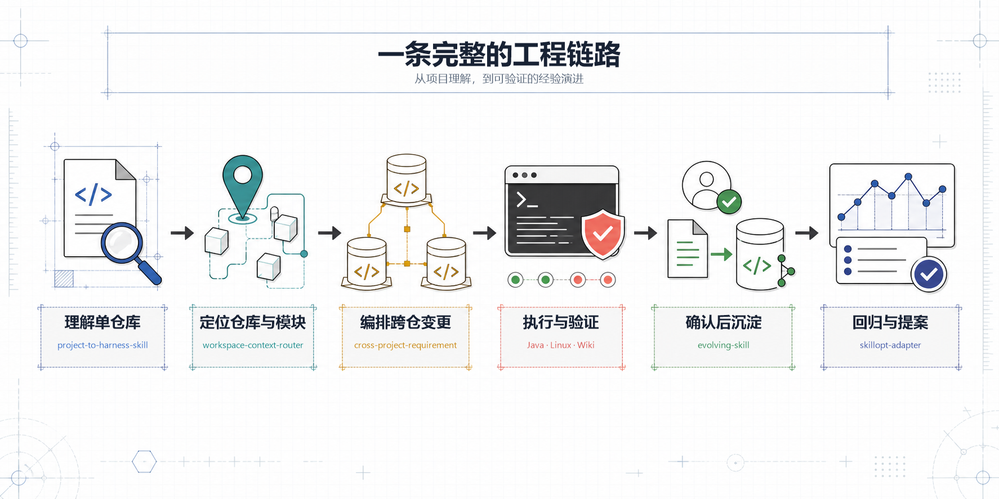

# AI Skill Repository

[English](README.en.md) · [GitHub](https://github.com/Barry04/ai-skill-repository)

[](https://github.com/Barry04/ai-skill-repository/actions/workflows/package-and-install-skills.yml)
[](https://github.com/Barry04/ai-skill-repository/actions/workflows/skill-regression.yml)
[](LICENSE)

面向 **Codex、Cursor 和 Claude** 的工程型 Agent Skill 集合。

把项目理解、多仓定位、跨仓变更、远程验证和经验沉淀，整理成可安装、可审查、可版本管理的工作流。Agent 不必每次从零摸索，人仍然掌握写入、分支和发布等关键决定。

这不是提示词清单。每个 Skill 都是一个自包含目录，可以同时带上 `SKILL.md`、参考资料、脚本和模板；Agent 只在任务需要时读取相关内容。

设计参考 [Harness Engineering](https://github.com/deusyu/harness-engineering) 和 [Agent Skills](https://agentskills.io)：**仓库是记录系统，入口是地图，人类掌舵，Agent 执行。**

## 60 秒开始

克隆仓库：

```bash
git clone https://github.com/Barry04/ai-skill-repository.git
cd ai-skill-repository
```

安装全部 Skill：

| 平台 | 命令 |
| --- | --- |
| Windows | `.\install.ps1` |
| macOS / Linux | `bash install.sh` |

Windows 如果被 PowerShell 执行策略拦截，可只对本次安装临时绕过：

```powershell
powershell.exe -NoProfile -ExecutionPolicy Bypass -File .\install.ps1
```

脚本会把 `skill/` 下的全部 Skill 安装到：

- Codex：`$CODEX_HOME/skills`，未设置时为 `~/.codex/skills`
- Cursor：`~/.cursor/skills`
- Claude：`~/.claude/skills`

> [!WARNING]
> 安装是“按仓库版本覆盖”，不是增量合并。目标位置中与本仓库同名的 Skill 目录会先删除再复制；如果你直接改过全局安装目录，请先备份。

安装后可以直接这样提问：

```text
请使用 project-to-harness-skill 扫描当前项目，先给我 Harness 化预览，我确认后再写入。
```

```text
这个需求涉及多个仓库。先建立职责地图和影响矩阵，实施前提醒我确认同名分支。
```

```text
把构建产物部署到 Linux 测试机，运行验证并回收日志；不要执行范围外的远程操作。
```

## 你可以用它做什么

| 场景 | Skill | 解决的问题 |
| --- | --- | --- |
| 项目理解 | [`project-to-harness-skill`](skill/project-to-harness-skill/SKILL.md) | 扫描新项目、遗留项目或开源项目，先预览，再生成 `AGENTS.md`、Harness 文档和合格的项目级 Skill |
| 多项目定位 | [`workspace-context-router`](skill/workspace-context-router/SKILL.md) | 用可人工审查的 `workspace.yaml` 把请求路由到正确仓库、模块和上下文入口 |
| 跨仓需求 | [`cross-project-requirement`](skill/cross-project-requirement/SKILL.md) | 建立带代码证据的职责地图与影响矩阵，确认同名分支，按契约兼容性编排实施和验证 |
| Java 排错 | [`java-backend-troubleshooting`](skill/java-backend-troubleshooting/SKILL.md) | 定位 Spring 事务不回滚、MyBatis 分页失效和常见 Java 后端问题 |
| Linux 验证 | [`linux-test-executor`](skill/linux-test-executor/SKILL.md) | 通过 SSH 上传、执行测试、采集日志，并限制远程操作范围 |
| Wiki 协作 | [`read-wiki-via-mcp`](skill/read-wiki-via-mcp/SKILL.md) | 通过本地 Atlassian MCP 读取、创建和更新 Confluence / Wiki 页面 |
| 经验沉淀 | [`evolving-skill`](skill/evolving-skill/SKILL.md) | 识别可复用经验，先征得用户同意，再写入当前项目的 `skill/` 和索引 |
| 质量治理 | [`skillopt-adapter`](skill/skillopt-adapter/SKILL.md) | 对 Skill 做 benchmark、regression 和候选提案审查，避免优化结果直接覆盖正式版本 |

## 一条完整的工程链路

[](docs/assets/engineering-workflow.png)

不需要每个任务都走完整链路。Agent 根据任务只读取高相关 Skill；细节继续下沉到 `references/`、`tools/`、`scripts/` 和 `assets/`，避免把所有上下文一次塞进会话。

## 设计边界

| 原则 | 仓库中的做法 |
| --- | --- |
| 先看证据再行动 | Harness 化、项目职责和影响范围都从仓库事实出发，不凭名称猜测 |
| 先预览再写入 | 项目 Harness 和新 Skill 默认先给预览；用户确认后才落盘 |
| 人控制关键决定 | 不自动切换多仓分支；需要并行开发时先提醒并确认分支策略 |
| 上下文可审查 | 多项目路由使用可读的 YAML，不把项目关系藏进 SQLite 或隐式状态 |
| 优化不直写 | SkillOpt 结果先进 `experiments/skillopt/` 和 `proposals/`，正式 Skill 仍需人工确认 |
| 敏感信息不沉淀 | 密码、Token、私钥和生产细节不得写入 Skill；配置使用占位符和样例 |

## 质量与兼容性

- [安装流水线](.github/workflows/package-and-install-skills.yml) 会打包 Windows / Unix 版本，并在 Windows、macOS、Linux 上验证 Codex、Cursor、Claude 三个安装目标。
- [确定性回归](.github/workflows/skill-regression.yml) 当前覆盖 `java-backend-troubleshooting` 和 `workspace-context-router`；没有评测的 Skill 会在 CI 中明确告警。
- CI 不调用模型或外部付费优化服务。`skillopt-adapter` 管理评测与提案流程，不宣称一键自动优化。
- Skill 以普通文件保存，可通过 Git 审查、回滚和发布，不依赖私有数据库。

部分 Skill 有额外运行依赖，只有使用对应能力时才需要安装：

| Skill | 可选依赖 |
| --- | --- |
| `workspace-context-router` | Python 3；按 [`requirements.txt`](skill/workspace-context-router/scripts/requirements.txt) 安装 Python 依赖 |
| `linux-test-executor` | Python 3、`ssh`、`scp`、可访问的测试机和有效凭据 |
| `read-wiki-via-mcp` | 本机 `localhost:9000` 的 Atlassian MCP 服务 |

## 仓库如何组织

```text
AGENTS.md                    # Agent 入口与 Skill 路由地图
skill/<name>/SKILL.md        # 正式、可安装的 Skill
eval/<skill>/                # 确定性回归用例与评分标准
experiments/skillopt/        # 本地优化实验产物，不安装
proposals/<skill>/           # 待人工审查的候选修改
scripts/skillopt/            # 评分与 proposal 工具
install.ps1 / install.sh     # 全量安装脚本
```

渐进披露路径：`AGENTS.md` → `skill/<name>/SKILL.md` → 按需读取参考资料或工具。

> `ai-skill-repository` 是仓库名；`evolving-skill` 是其中负责经验演进的一个协议。它生成或更新的业务 Skill 应保存在当前项目中，而不是直接写进全局安装目录。

## 维护与扩展

- Agent 进入本仓库时先读 [`AGENTS.md`](AGENTS.md)。
- 新增、合并或优化 Skill 时按 [`UPGRADE.md`](UPGRADE.md) 的检查清单执行。
- 可复用经验只有在用户明确同意后，才写入当前项目的 `skill/`。
- 欢迎通过 [Issues](https://github.com/Barry04/ai-skill-repository/issues) 提交场景和问题，通过 Pull Request 改进 Skill。

## License

[Apache License 2.0](LICENSE)
